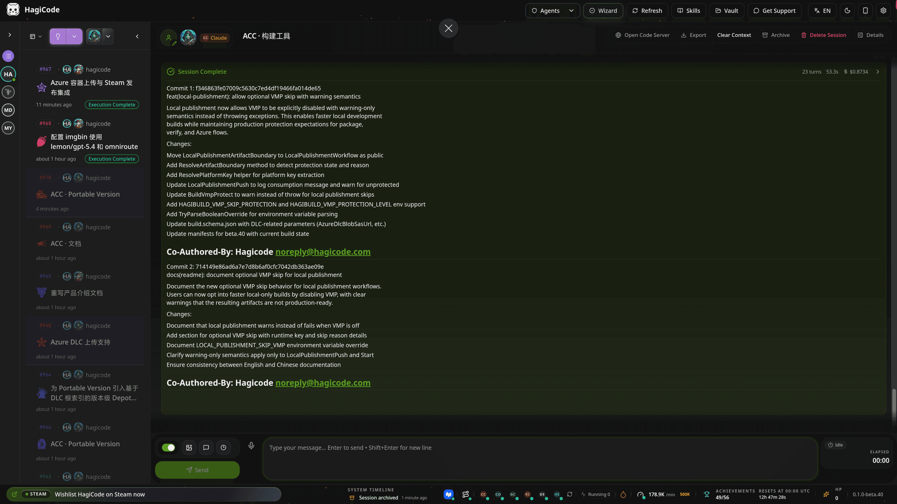
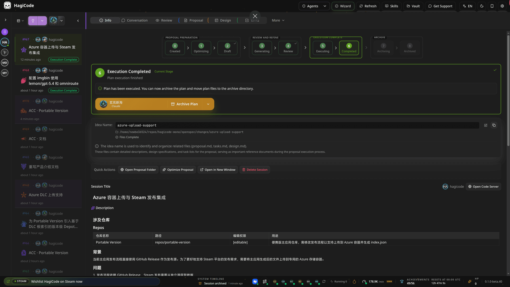
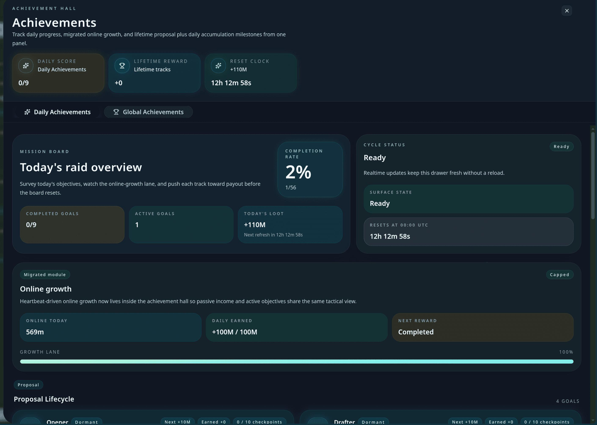

<h1 align="center">Hi 👋, I'm newbe36524</h1>
<h3 align="center">Creator of Hagicode — AI-powered coding with the OpenSpec workflow</h3>

<p align="left">  </p>

<p align="left"> <a href="https://twitter.com/newbe36524" target="blank"></a> </p>

- 🔭 I'm currently working on **[Hagicode](https://hagicode.com)** — an AI coding assistant that turns ideas into reviewable proposals, tasks, and commits
- 🪟 Get Hagicode on **[Microsoft Store](https://apps.microsoft.com/detail/9N3PM0N3SVDW)**
- 👨‍💻 All of my projects are available at [https://www.github.com/newbe36524](https://www.github.com/newbe36524)
- 📝 I regularly write articles on [https://www.newbe.pro](https://www.newbe.pro)
- 📫 How to reach me **newbe36524@qq.com**

---

## 🚀 Hagicode

**Hagicode** brings AI into the full software development process: understanding repositories, planning changes, implementing code, organizing commits, tracking knowledge, and keeping work reviewable from idea to archive.

[Website](https://hagicode.com) · [Product Overview](https://docs.hagicode.com/product-overview/) · [Desktop](https://hagicode.com/desktop/) · [Microsoft Store](https://apps.microsoft.com/detail/9N3PM0N3SVDW) · [Blog](https://docs.hagicode.com/blog/)

<p align="center">
  <a href="https://hagicode.com/">
    
  </a>
</p>

### Core Capabilities

| 🧠 Proposal-driven | ⚡ Multi-threaded | 🎮 Gamified |
|--------------------|------------------|-------------|
| OpenSpec workflow | Quota usage 20% → 100% | Make coding fun again |

**OpenSpec Workflow** — Hagicode starts with a proposal instead of jumping straight into file edits. OpenSpec turns requests into scope, tasks, impact analysis, validation steps, and an execution trail that stays easy to review.

```
💡 IDEA → 📄 PROPOSAL → 🔍 REVIEW → ⚙️ TASKS
                 ↓
💻 CODE → 🧪 TEST → 🔧 REFACTOR → 📚 DOCS → ✅ ARCHIVE
```

<p align="center">
  
</p>

<p align="center">
  
</p>

### 🪟 Get Hagicode on Microsoft Store

<table>
  <tr>
    <td width="160" align="center">
      
    </td>
    <td>
      <strong>Hagicode for Windows</strong><br/>
      The current public entry point for the Hagicode desktop app.<br/>
      <a href="https://apps.microsoft.com/detail/9N3PM0N3SVDW"><strong>🛍️ Open in Microsoft Store</strong></a> ·
      <a href="https://hagicode.com/desktop/">Desktop downloads</a> ·
      <a href="https://docs.hagicode.com/faq/steam-distribution-status/">Steam status FAQ</a>
    </td>
  </tr>
</table>

> Add-ons: **[Hagicode Plus](https://docs.hagicode.com/bundles/hagicode-plus/)** bundle and **[Turbo Engine DLC](https://docs.hagicode.com/dlc/turbo-engine-dlc/)** for higher concurrency and customization.

---

### My GitHub Contributions

<picture>
  <source media="(prefers-color-scheme: dark)" srcset="https://raw.githubusercontent.com/newbe36524/newbe36524/main/assets/github-snake-dark.svg" />
  <source media="(prefers-color-scheme: light)" srcset="https://raw.githubusercontent.com/newbe36524/newbe36524/main/assets/github-snake.svg" />
  
</picture>

<h3 align="left">Connect with me:</h3>
<p align="left">
<a href="https://twitter.com/newbe36524" target="blank"></a>
<a href="https://linkedin.com/in/newbe36524" target="blank"></a>
<a href="https://www.newbe.pro/atom.xml" target="blank"></a>
<a href="https://hagicode.com/" target="blank"></a>
</p>

<h3 align="left">Languages and Tools:</h3>
<p align="left"> <a href="https://www.w3schools.com/cs/" target="_blank">  </a> </p>

<p>&nbsp;</p>

<p></p>
